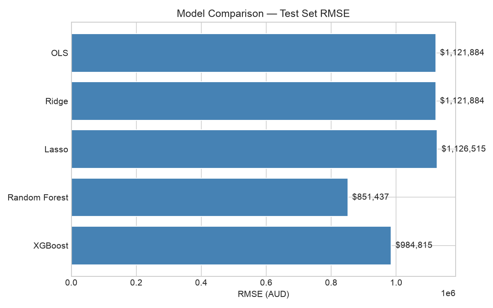

# NSW Property Price Prediction


An end-to-end machine learning project predicting NSW residential property sale prices using 1.88 million publicly available government transactions (2010–2026). Built as a portfolio project demonstrating the full data science workflow: exploratory analysis → feature engineering → multi-model comparison → SHAP interpretation.

---

## Key Findings

- **Random Forest achieved the best R² (0.59)** with RMSE of $843k, outperforming the OLS baseline by 25% on RMSE.
- **Location (suburb) is the dominant price driver** — SHAP analysis and RF feature importance (71.9%) confirm suburb mean price accounts for the majority of prediction variance.
- **Land area has a log-linear relationship** with sale price; each doubling of lot size corresponds to roughly a 9.8% price increase (Ridge coefficient = 0.098 on log-transformed area).
- **47.6% of XGBoost predictions fall within 20% of the actual sale price**, consistent with entry-level automated valuation model (AVM) accuracy using only four features.

---

## Model Comparison

| Model | RMSE (AUD) | MAE (AUD) | R² |
|-------|-----------|-----------|-----|
| **Random Forest** | **$843,386** | **$290,478** | **0.59** |
| XGBoost | $992,728 | $353,823 | 0.43 |
| OLS | $1,120,146 | $436,329 | 0.27 |
| Ridge | $1,121,884 | $436,424 | 0.27 |
| Lasso | $1,126,514 | $436,615 | 0.26 |

*Evaluated on 375,514 held-out test properties. Metrics reported in AUD (predictions exponentiated back from log-space).*



---

## Project Structure

```
├── README.md
├── requirements.txt
├── .gitignore
│
├── data/
│   ├── raw/          ← download dataset here (gitignored)
│   └── processed/    ← generated by notebook 02 (gitignored)
│
├── notebooks/
│   ├── 01_eda.ipynb                  ← exploratory data analysis
│   ├── 02_feature_engineering.ipynb  ← cleaning, encoding, train/test split
│   ├── 03_modelling.ipynb            ← model training & MSE comparison
│   └── 04_interpretation.ipynb       ← coefficients, SHAP, residuals
│
├── src/
│   ├── data_loader.py    ← load raw CSV, rename columns to snake_case
│   ├── preprocessing.py  ← sklearn Pipeline + ColumnTransformer
│   └── evaluation.py     ← metrics, comparison table, bar chart
│
└── reports/
    └── figures/          ← saved plots referenced in this README
```

---

## Dataset

**Source:** NSW Valuer General / NSW Land Registry Services — Bulk Property Sales Information  
**URL:** [data.nsw.gov.au](https://data.nsw.gov.au/) — search *"Property Sales Information"*  
**Licence:** Creative Commons Attribution 4.0 (CC BY 4.0)  
**Coverage:** All NSW residential property sales 2010–2026 (1.88M rows after cleaning)

### Download Instructions

1. Go to [data.nsw.gov.au](https://data.nsw.gov.au/) and search for **"Property Sales Information"**
2. Download the bulk sales ZIP file(s) for your desired year range
3. Extract and concatenate the CSVs into a single file named `property_sales.csv`
4. Place it at `data/raw/property_sales.csv`

---

## How to Reproduce

```bash
# 1. Clone the repository
git clone https://github.com/<your-username>/nsw-property-price-prediction
cd nsw-property-price-prediction

# 2. Create and activate a virtual environment
python -m venv venv
source venv/bin/activate      # macOS/Linux
# venv\Scripts\activate       # Windows

# 3. Install dependencies
pip install -r requirements.txt

# macOS only — required for XGBoost
brew install libomp

# 4. Download the dataset (see instructions above)
#    Place the CSV at: data/raw/property_sales.csv

# 5. Run notebooks in order
jupyter notebook
# Open notebooks/ and run 01 → 02 → 03 → 04 in sequence
```

**Expected runtime:** ~10–20 minutes end-to-end (the Random Forest cross-validation step dominates).

---

## Methodology

### Data Cleaning
- Residential sales only (`nature_of_property = R`)
- Price filter: $50k–$30M (removes data-entry errors and non-arm's-length transfers)
- Date filter: 2010 onwards (15 years of market data covering multiple cycles)
- Area unified to m² (hectare rows × 10,000), capped at 500,000 m²

### Feature Engineering
- Log-transform of both target (`purchase_price`) and land area — both are heavily right-skewed
- **Target encoding** for suburb: each suburb replaced by its mean log-price computed on the training set. Handles ~1,100 unique NSW suburbs without creating a sparse one-hot matrix. Clip to ±3σ to prevent extreme suburbs from destabilising linear models.
- `sklearn.Pipeline` + `ColumnTransformer` ensures all transformations are fit on train data only — no leakage

### Models
Five models compared using 5-fold cross-validation on training set, final evaluation on a held-out 20% test set:

| Model | Notes |
|---|---|
| OLS | Baseline; no regularisation |
| Ridge (L2) | Alpha tuned via 5-fold CV |
| Lasso (L1) | Alpha tuned via 5-fold CV |
| Random Forest | 200 trees, min_samples_leaf=5 |
| XGBoost | 3,000 estimators, lr=0.3, early stopping on 20% val set |

### Interpretation
- Standardised coefficients (Ridge/Lasso) for direct marginal-effect reading
- Impurity-based feature importances (Random Forest, XGBoost)
- SHAP `TreeExplainer` — model-agnostic, directional attribution on 2,000 test samples

---

## Tech Stack

| Tool | Purpose |
|------|---------|
| Python 3.11 | Core language |
| pandas / NumPy | Data loading and manipulation |
| scikit-learn | Preprocessing pipelines, OLS, Ridge, Lasso, Random Forest |
| XGBoost | Gradient boosting |
| Matplotlib / Seaborn | Visualisations |
| SHAP | Model interpretation |
| pyarrow | Parquet serialisation for processed data |
| Jupyter Notebooks | Interactive analysis environment |

---

## About

Data science graduate with Python, pandas, scikit-learn, and SQL skills. This project demonstrates end-to-end ML on a real 1.88M-row Australian government dataset.

- [LinkedIn](https://linkedin.com/in/your-profile)
- [GitHub](https://github.com/your-username)
- [Email](mailto:v.ngan.le@gmail.com)

---

*Data sourced from NSW Government open data under CC BY 4.0. This project is for educational and portfolio purposes only.*
