# NSW Property Price Prediction
## Technical Report

**Author:** Ngan Le | v.ngan.le@gmail.com | [GitHub](https://github.com/nancy-vn-le)  
**Data:** NSW Valuer General / Land Registry Services, 1.88M residential sales, 2010-2026  
**Source:** [data.nsw.gov.au](https://data.nsw.gov.au/) - CC BY 4.0

---

## Contents

1. [Executive Summary](#1-executive-summary)
2. [Data Overview](#2-data-overview)
3. [Exploratory Analysis](#3-exploratory-analysis)
4. [Feature Engineering](#4-feature-engineering)
5. [Model Training](#5-model-training)
6. [Model Comparison](#6-model-comparison)
7. [Model Interpretation](#7-model-interpretation)
8. [Residual Analysis](#8-residual-analysis)
9. [Limitations](#9-limitations)
10. [Further Work](#10-further-work)

---

## 1. Executive Summary

This report documents an end-to-end regression project on 1.88 million NSW residential property sales spanning 2010 to 2026. Five models were trained and evaluated on a held-out test set of 375,514 properties: OLS, Ridge, Lasso, Random Forest, and XGBoost.

**Random Forest achieved the best performance** - R² = 0.59, RMSE = $843k, MAE = $290k - outperforming the OLS baseline by 25% on RMSE. The large performance gap between tree models and linear models (31 percentage points of R²) points to non-linear interactions between suburb, land area, and time that a linear combination cannot capture.

**SHAP and feature importance analysis confirm that location is the dominant price driver**, accounting for 71.9% of Random Forest feature importance. Once suburb is target-encoded as its mean log-price, it correlates at 0.68 with the log-price target - higher than any other available feature. Land area follows a log-linear relationship (Ridge coefficient 0.098), year captures the secular market trend (coefficient 0.129), and settlement quarter has negligible impact (coefficient 0.017).

The model's accuracy is consistent with entry-level automated valuation model (AVM) performance on a four-feature set: 25.6% of XGBoost predictions fall within 10% of the actual sale price, and 47.6% within 20%.

---

## 2. Data Overview

### Source and raw structure

The dataset is the NSW Valuer General Bulk Property Sales file, publicly available at data.nsw.gov.au under CC BY 4.0. The raw CSV contains 2,202,140 rows and 20 columns, covering all property types across NSW. After filtering to residential sales only (`nature_of_property = R`), 1,884,818 rows remain.

### Missing values

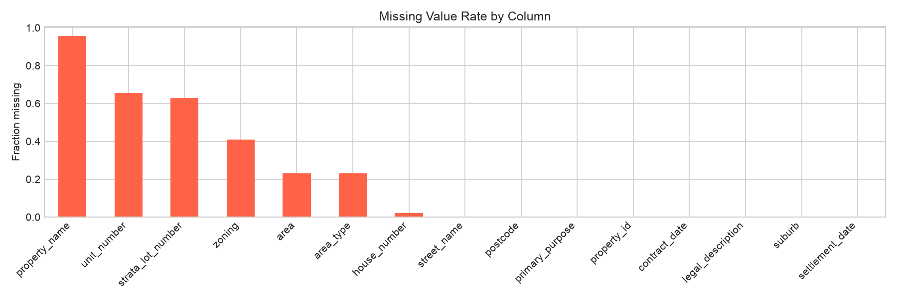

Missing data is concentrated in fields that are structurally absent for most property types. `property_name` (95.8% missing), `unit_number` (65.7%), and `strata_lot_number` (62.9%) are not populated for standalone houses - the dominant record type. These columns are excluded from modelling entirely.

The only modelling-relevant column with significant missingness is `area` (23.0%). This is imputed using suburb-level medians rather than the global median, because lot sizes differ substantially between inner-city and regional areas - a global fill would systematically underestimate areas in low-density suburbs and overestimate them in urban ones.

`suburb` and `purchase_price` are near-complete (<0.1% missing each), which is important given that both are central to the modelling approach.

### Cleaning decisions

| Decision | Detail |
|---|---|
| Scope | Residential sales only - 85.6% of raw rows |
| Price range | $50k-$30M: removes gifts, data-entry errors, non-arm's-length transfers |
| Date range | 2010 onwards: pre-2010 records are sparse (<50k/year vs 170k+ post-2010) |
| Area units | Hectare rows converted to m² (×10,000); standardised across all rows |
| Area cap | 500,000 m² max: removes corrupt source values (up to 2.7 billion m²) |
| Missing area | Imputed with suburb-level median |

After cleaning: **1,877,569 residential sales**, contract dates 2010-01-08 to 2026-05-21.

---

## 3. Exploratory Analysis

### Target variable - sale price

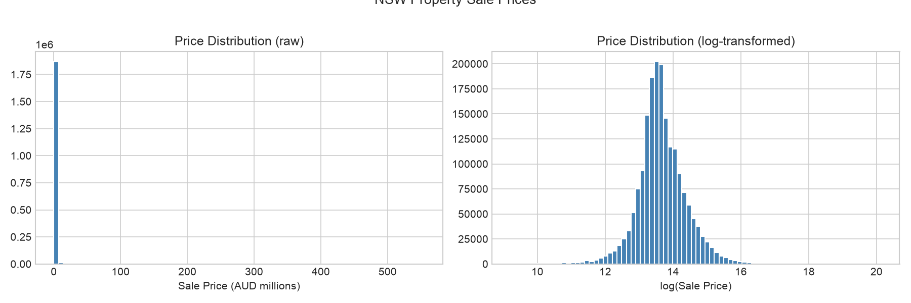

Sale price is strongly right-skewed. The raw distribution (left panel) has a skewness of 7.32: the median sits at $784k but the mean is pulled to $1.18M by a long tail reaching $946M at the raw maximum. A small number of ultra-high-value sales dominate the upper tail.

Log-transformation (right panel) reduces skewness to 0.29 - near-normal. This directly supports log(price) as the modelling target: linear models assume normally distributed residuals, and the log scale compresses the upper tail without discarding those transactions. All five models predict log(price); predictions are exponentiated back to AUD for evaluation.

### Numerical feature distributions

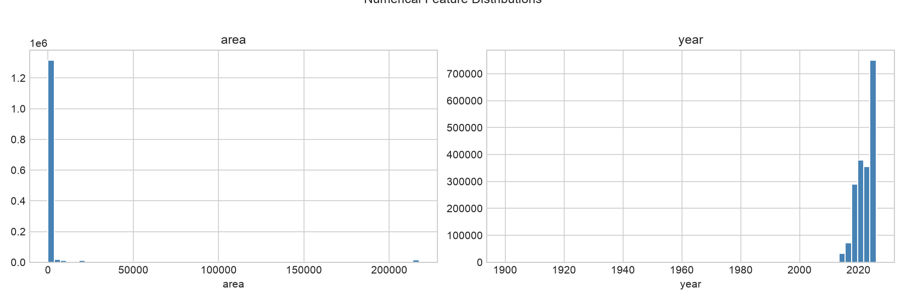

`area` is right-skewed even after filtering and unit standardisation - lot sizes are predominantly concentrated below 1,000 m² (inner-city and suburban properties), with a long tail of larger rural and semi-rural blocks. `year` is left-skewed within the 2010-2026 window, reflecting the growth in transaction volume over time as the NSW property market expanded.

### Market trend over time

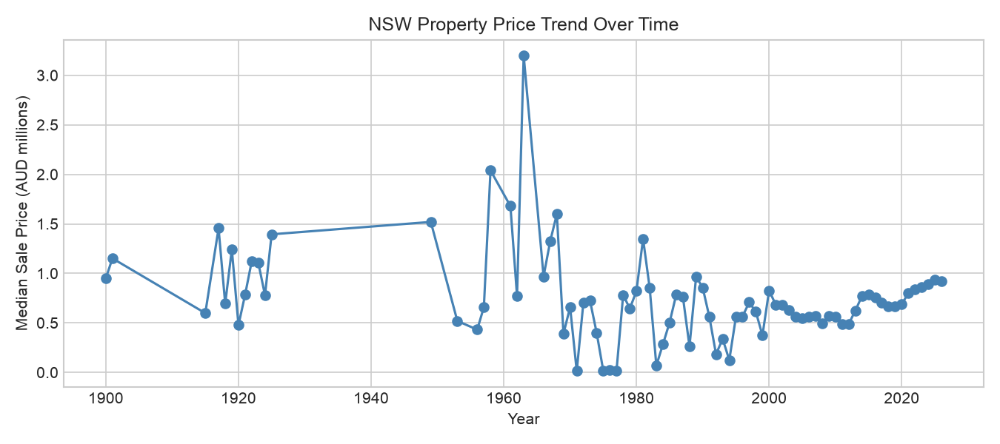

The median NSW property sale price more than doubled between 2010 and 2026, from approximately $430k to over $900k. The trend is not monotonic: the market peaked around 2017 at approximately $770k median, underwent a correction through 2019, then surged sharply through 2021 and into 2022 before the RBA rate cycle drove prices down from mid-2022 onwards. This non-linear trajectory is why a simple linear `year` feature captures the broad trend without accurately representing individual cycles.

### Geographic analysis - suburb price variation

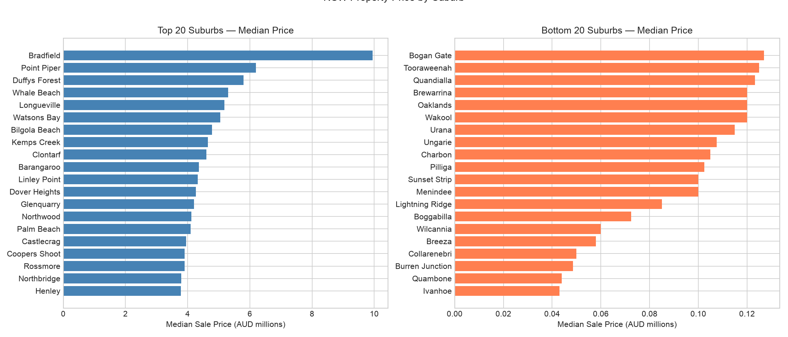

Suburb-level median prices span three orders of magnitude. The 20 most expensive suburbs (left panel) are concentrated in the Eastern Suburbs, Lower North Shore, and Northern Beaches of Sydney - Bradfield ($9.95M median), Point Piper ($6.2M), and Longueville ($5.18M) head the list. The 20 most affordable suburbs (right panel) are all in rural and regional NSW - far western, northern, and southern regions where median prices sit below $200k.

This variation is the strongest signal in the dataset. A model that correctly identifies a property's suburb can already explain the majority of the price. There are 4,021 unique suburbs in the cleaned data; encoding them requires a strategy that avoids creating a 4,000-column sparse matrix.

### Correlation analysis

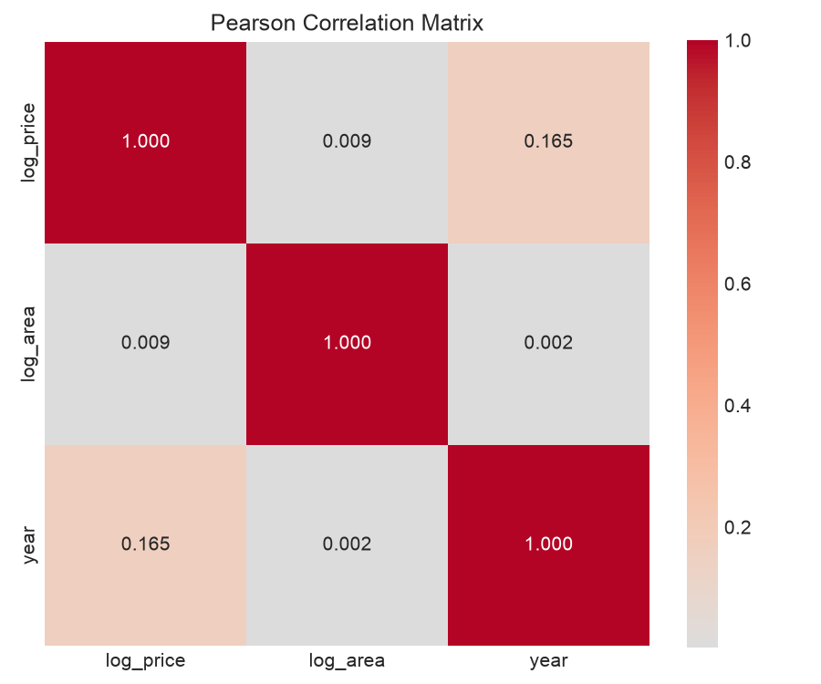

At the raw data stage, `log_area` shows a weak correlation with `log_price` (~0.03). This is misleading - the raw area column still contains unit inconsistencies and corrupt values, which add noise that suppresses the true signal. After cleaning, land area does contribute positively to price. `year` shows a moderate positive correlation (~0.17), consistent with the long-run appreciation trend.

`suburb` is absent from this matrix because it is a string column. Its pricing signal only becomes quantifiable after target encoding; once encoded, suburb-mean log-price correlates at **0.68** with the target - the dominant signal by a wide margin.

### Outlier detection

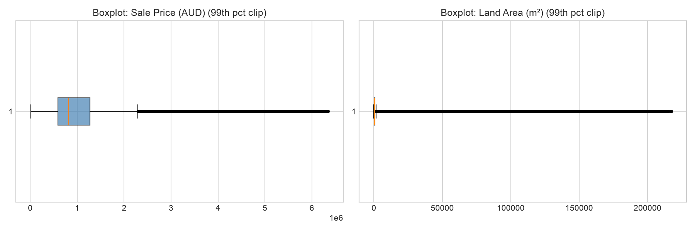

IQR analysis flags 8.5% of price rows and 9.6% of area rows as outliers. For price, a hard filter of $50k-$30M is applied rather than a percentile cap: this removes genuine data-quality issues while retaining all legitimate high-value sales. Removing moderate-to-high-value sales ($3M-$30M) would degrade suburb encoding quality for affluent suburbs, since those transactions provide the ground truth for the target encoding.

For area, the extreme values (up to 2.7 billion m²) are clearly corrupt - they result from rows where the source system recorded area in hectares and the conversion multiplied an already-large value by 10,000. These are capped at 500,000 m² (50 hectares).

---

## 4. Feature Engineering

### Target encoding for suburb

With 4,021 unique suburbs, one-hot encoding would produce a sparse ~4,000-column matrix - memory-intensive for a 1.5M training set and harmful to linear models. **Target encoding** replaces each suburb with its mean log-price computed on the training set only. This collapses location into a single continuous feature that captures the price premium of each suburb without creating high-dimensional sparsity.

Two safeguards prevent leakage and instability:

1. **Train-only computation:** Target means are computed after the train/test split. Unseen test suburbs fall back to the global training mean.
2. **Clipping to ±3 standard deviations:** Suburbs at the extreme ends of the encoding distribution (e.g., a suburb with only 2-3 transactions, one of which was a $20M sale) can produce mean log-prices far from the bulk of the distribution. After StandardScaler, these produce large z-scores that destabilise linear models. Clipping brings the maximum encoded z-score below 3.1.

### Log-transformations

Both the target (`purchase_price`) and the `log_area` feature are log-transformed. The area-price relationship is log-linear rather than linear: doubling lot size does not double the price, but each proportional increase in area is associated with a constant proportional increase in price. Log-transforming both sides linearises this relationship and improves model fit.

### Final feature set

| Feature | Type | Notes |
|---|---|---|
| `suburb_encoded` | Continuous | Train-set mean log-price per suburb, clipped ±3σ |
| `log_area` | Continuous | `log1p(area_m2)` after unit conversion and capping |
| `year` | Integer | Contract year, 2010-2026 |
| `quarter` | Integer | Contract quarter, 1-4 |

All features are passed through `StandardScaler` inside a scikit-learn `Pipeline` + `ColumnTransformer`. The pipeline is fit on the training set only; the same fitted scaler is applied to the test set.

**Train/test split:** 80/20, stratified by shuffle, `random_state=42` - 1,502,055 train / 375,514 test.

---

## 5. Model Training

Five models were trained on the same processed feature set:

**OLS (Ordinary Least Squares):** No regularisation. Provides an interpretable baseline - coefficients directly represent marginal effects of each standardised feature on log-price.

**Ridge (L2 regularisation):** Shrinks coefficients toward zero while retaining all features. Alpha selected by 5-fold cross-validation over a log-spaced grid (0.01 to 10,000). Best alpha = 6.55.

**Lasso (L1 regularisation):** Drives some coefficients to exactly zero, effectively performing feature selection. Best alpha = 0.01 (CV grid minimum); all 4 features were retained (no zeroing out), indicating that sparsity is not beneficial in this low-dimensional setting.

**Random Forest:** 200 trees, `min_samples_leaf=5`, trained on bootstrap samples. The `min_samples_leaf` constraint prevents individual trees from perfectly memorising individual transactions and improves generalisation. All CPU cores used (`n_jobs=-1`).

**XGBoost:** 3,000 estimators, `learning_rate=0.3`, `max_depth=6`, `subsample=0.8`, `colsample_bytree=0.8`. Early stopping halted training at round 2,703 based on validation RMSE on a 10% hold-out from the training set (separate from the test set - no leakage).

---

## 6. Model Comparison

### Test set results (375,514 properties)

| Model | RMSE (AUD) | MAE (AUD) | R² |
|---|---|---|---|
| **Random Forest** | **$843,386** | **$290,478** | **0.59** |
| XGBoost | $984,815 | $352,009 | 0.44 |
| OLS | $1,121,884 | $436,424 | 0.27 |
| Ridge | $1,121,884 | $436,424 | 0.27 |
| Lasso | $1,126,515 | $436,615 | 0.26 |

*All models predict log(price); metrics are computed after exponentiating back to AUD.*

Random Forest is the clear winner across all three metrics. The result that stands out most is not the Random Forest performance, but the **collapse of regularised linear models**: Ridge and Lasso perform almost identically to plain OLS, with essentially no improvement from regularisation. With only 4 features and 1.5M training samples, there is no variance problem for regularisation to solve. The limit is the linear functional form.

The 31 percentage-point R² gap between OLS (0.27) and Random Forest (0.59) quantifies the non-linearity of NSW property pricing. Suburb encoding, land area, and year interact in ways that a linear combination cannot represent - for example, the premium for a large lot is very different in Mosman versus Dubbo, and that interaction is invisible to a linear model.

**XGBoost vs Random Forest:** XGBoost underperforms Random Forest here despite typically being the stronger tabular model. In a 4-feature space with 1.5M samples, bagging benefits from the large sample count. Gradient boosting's iterative residual correction, which excels at exploiting subtle patterns across many features, has limited material to work with in this low-dimensional setting.

---

## 7. Model Interpretation

### Linear model coefficients

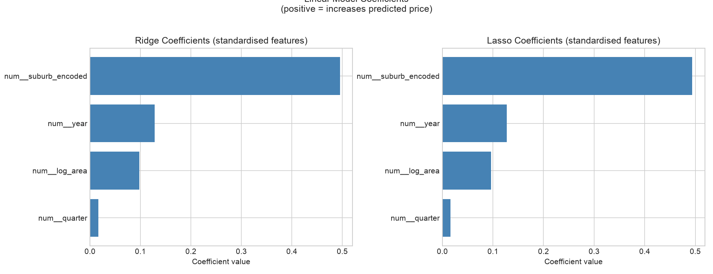

Ridge and Lasso coefficients on standardised features measure the marginal contribution of each feature to predicted log-price:

| Feature | Ridge | Lasso |
|---|---|---|
| suburb_encoded | 0.495 | 0.494 |
| year | 0.129 | 0.129 |
| log_area | 0.098 | 0.098 |
| quarter | 0.017 | 0.017 |

All four coefficients are positive. Location (suburb_encoded) contributes 4× more than year and 5× more than log_area. The near-identical Ridge and Lasso coefficients confirm that no feature is redundant - Lasso retains all four because each carries independent predictive signal.

Interpreting `log_area` on standardised log-area: a Ridge coefficient of 0.098 means that doubling lot size (which increases log_area by ~0.69) corresponds to approximately a 6.8% increase in predicted price, all else equal.

### Tree feature importances

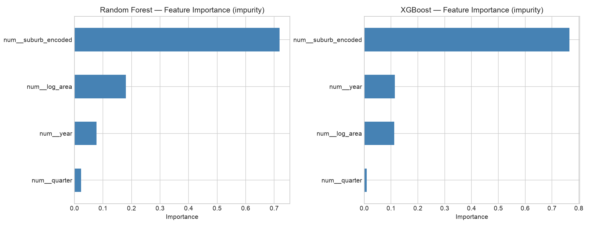

Both Random Forest and XGBoost assign suburb_encoded the largest share of impurity reduction:

| Feature | RF Importance | XGBoost Importance |
|---|---|---|
| suburb_encoded | 71.9% | 68.3% |
| log_area | 18.1% | 19.4% |
| year | 7.6% | 10.1% |
| quarter | 2.4% | 2.2% |

The suburb signal dominates to a degree that makes intuitive sense - in the Australian property market, two identical houses on the same street but in different suburb boundaries can be valued hundreds of thousands of dollars apart. The target encoding captures that difference directly.

### SHAP analysis (XGBoost)

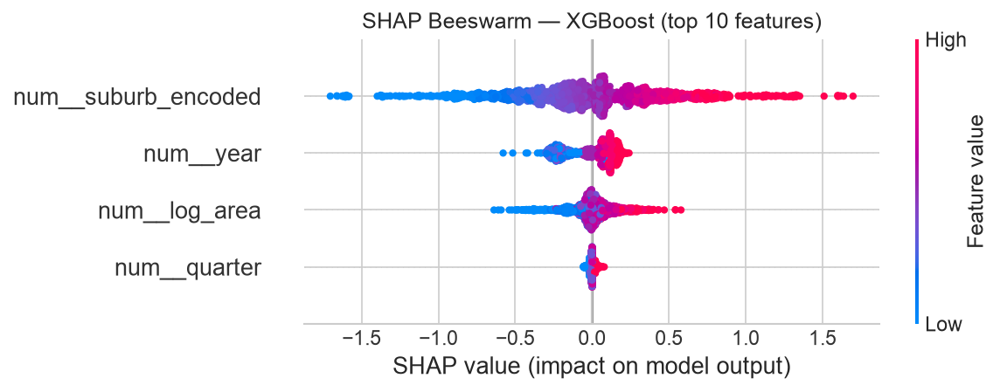

SHAP (SHapley Additive exPlanations) provides directional, per-property attribution. Each dot represents one of 2,000 sampled test properties; its horizontal position is the SHAP contribution to the predicted log-price; its colour is the feature value (red = high, blue = low).

Key observations:

- **suburb_encoded** produces the widest horizontal spread of any feature. High-value suburbs (red) generate large positive SHAP contributions; low-value suburbs (blue) generate large negative ones. A single standard deviation shift in suburb encoding can shift the predicted log-price by over 0.5 units - roughly ±60% in AUD terms. This swamps all other features.
- **log_area** shows a clear monotonic relationship: larger properties (red) consistently receive positive SHAP values; smaller ones (blue) receive negative values. The relationship is smooth and consistent across the test set.
- **year** contributes a narrow but uniformly positive SHAP distribution. The secular appreciation trend is present but modest relative to location.
- **quarter** clusters near zero for almost all properties, confirming it adds negligible price signal.

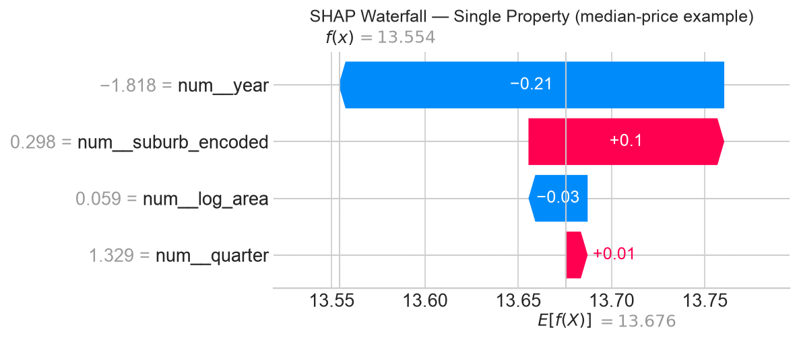

The waterfall chart shows the feature-by-feature decomposition for a single median-priced test property. Starting from the model's base value (the average log-price across all training predictions), each feature pushes the prediction up or down. For this representative example, suburb_encoded provides the largest single contribution, followed by log_area, year, and quarter as minor adjustments.

---

## 8. Residual Analysis

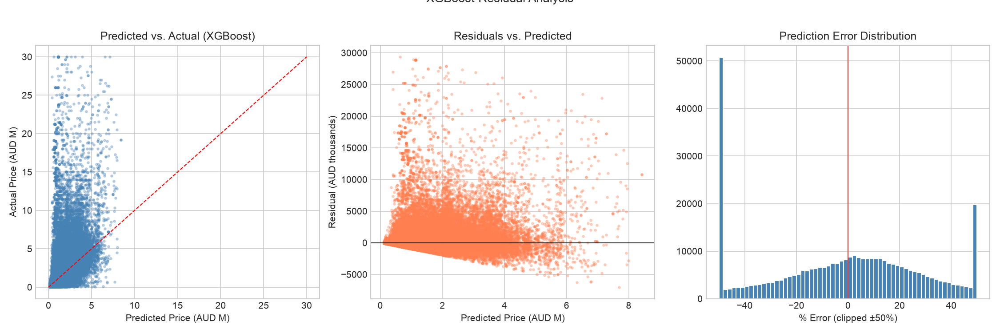

The three panels show: predicted vs. actual (left), residuals vs. predicted (centre), and the error percentage distribution (right).

**Predicted vs. actual:** The bulk of predictions cluster tightly around the 45° line for properties up to approximately $2M. Above $3M, the scatter widens and predictions increasingly fall below the 45° line - the model systematically underestimates high-end properties.

**Residuals vs. predicted:** The fan shape is characteristic of heteroscedasticity - variance increases with predicted value. This is expected when high-value properties depend on attributes (quality, views, renovation status, architectural design) that are not in the feature set. The model cannot distinguish a $5M house from a $3M house in the same suburb based on lot size and year alone.

**Error distribution:** 25.6% of predictions fall within 10% of actual price; 47.6% within 20%. The distribution is right-skewed, confirming the systematic underestimation of premium properties.

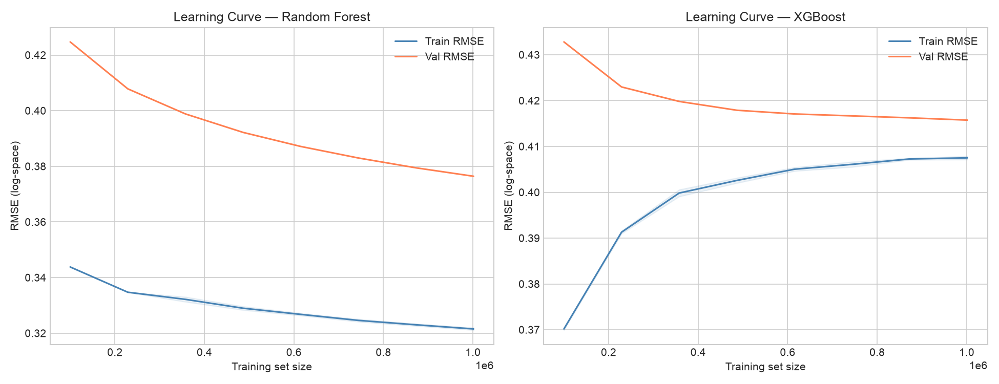

Learning curves plot validation RMSE against training set size for Random Forest and XGBoost. Both models show:

- Train RMSE and validation RMSE converge as training set size grows - neither model is severely overfitting
- The validation curve stabilises around 800,000-1,000,000 samples and does not improve significantly with more data

This plateau suggests the models are approaching their capacity limit with the current feature set. Additional training data is unlikely to improve performance meaningfully without also adding richer property attributes.

---

## 9. Limitations

**Thin feature set:** Four features is sparse for property valuation. Commercial AVMs typically incorporate bedrooms, bathrooms, floor area, land area, year built, condition rating, building type, and proximity features. The R² ceiling with this feature set is estimated at 0.60-0.65 for tree models, consistent with the observed 0.59.

**Suburb encoding cold-start:** Target encoding falls back to the global mean log-price for suburbs with few historical sales. Fast-growing outer-urban and greenfield suburbs - exactly the areas where first-home buyers are most active - get the weakest location signal.

**Linear time representation:** A single `year` feature captures the secular trend but cannot represent the 2017 peak, the 2019-2020 correction, or the rate-driven pullback from mid-2022. For any year in the test set, the model predicts the expected price on a smoothed trend line rather than the actual market level at that point.

**No spatial structure:** Suburbs are treated as independent units. In reality, adjacent suburbs are strongly correlated - a smoothing approach or lat/lon features would improve predictions for suburbs with limited observations by borrowing strength from neighbours.

**Heteroscedastic residuals:** The fan-shaped residual pattern indicates that prediction uncertainty is not uniform. A point estimate with no uncertainty band understates model confidence for typical properties and overstates it for premium ones. A calibrated prediction interval model would be needed before this could be used in an AVM context.

---

## 10. Further Work

**Property attributes** - adding bedrooms, bathrooms, year built, and parking would likely lift R² to 0.75+ by enabling the model to distinguish quality within a suburb. This is the single highest-leverage improvement.

**Spatial features** - suburb centroid coordinates, distance to CBD, distance to nearest train station, and school zone ICSEA decile rating would give the model geographic signal beyond the suburb boundary, and reduce the cold-start problem for new suburbs.

**LightGBM native categorical handling** - rather than manually target-encoding suburb and clipping, LightGBM's built-in categorical split handling would manage high-cardinality suburbs more robustly, with no leakage risk and natural handling of unseen suburbs.

**Time-series formulation** - including lagged 12-month median suburb prices as a feature would let the model distinguish a $900k-trending suburb from a $900k-stagnant suburb. Walk-forward validation (training on data up to year T, predicting year T+1) would give a more realistic picture of out-of-sample performance in deployment.

**Calibration** - evaluating whether the model's 80% prediction interval contains the actual price 80% of the time is a prerequisite for any AVM deployment. A quantile regression forest or conformal prediction layer on top of the point estimate would provide this.

---

*Data sourced from NSW Government open data under CC BY 4.0. This project is for educational and portfolio purposes.*
